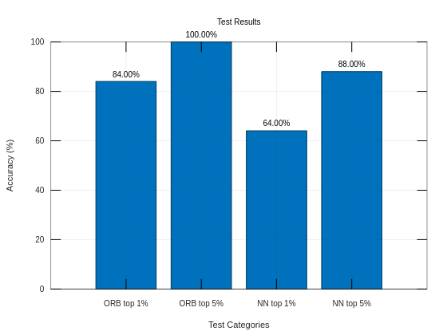

# Summary. Neural Network used. Architecture 

For the neural network image matching we have decided with the help of Mr. Maciej to go with the **VGG16** model which is a type of **CNN** (Convolutional Neural Network)

## Architecture


  
VGG16 (Visual Geometry Group 16) is a convolutional neural network (CNN) architecture designed for image classification

Here is the architecture seen in the images:

1. Input Layer: The network takes an input image of size 224x224 pixels with three color channels (RGB).
    
2. Convolutional Layers: The first two layers are 2D convolutional layers with 64 filters (3x3 kernel size) followed by max pooling layers (2x2 pool size).
    
3. Convolutional Layers: The next two layers are again 2D convolutional layers with 128 filters (3x3 kernel size) followed by max pooling layers.
    
4. Convolutional Layers: The next three layers are 2D convolutional layers with 256 filters (3x3 kernel size) followed by max pooling layers.
    
5. Convolutional Layers: The next three layers are 2D convolutional layers with 512 filters (3x3 kernel size) followed by max pooling layers.
    
6. Convolutional Layers: The last three layers are 2D convolutional layers with 512 filters (3x3 kernel size) followed by max pooling layers.
    
7. Fully Connected Layers: After the convolutional layers, there are three fully connected layers with 4096 neurons each.
    
8. Output Layer: The final layer is a softmax activation layer with 1000 neurons, representing the 1000 classes in the ImageNet dataset.

# Changes made for our use case.
We have figured that one way to do the image similarity searching is to use the embeds generated by the model and save them in 2 separate fields, one for each cover.
1st step was installing torch and torchvision libraries. We then instantiated a model variable that would be the model pre-trained on ImageNET1k dataset
```python
import torch
import torchvision.models as models

model = models.vgg16(weights="VGG16_Weights.IMAGENET1K_V1")
```

We then modify this model by chopping off the final classification layers so we only get the image embeds

```python
model = torch.nn.Sequential(*(list(model.children())[:-1]))
```

Now we have a model that gives us the embeddings of an image that goes through the neural network

Then we need to define the transforms, i.e how our image is gonna be pre-processed before going through out neural network. VGG has a specific set of transforms defined so we'll use that:

```python
transform = transforms.Compose([
	transforms.Resize(256),
	transforms.CenterCrop(224),
	transforms.ToTensor(),
	transforms.Normalize(mean=[0.485, 0.456, 0.406],
	std=[0.229, 0.224, 0.225]),
])
```

We then put the model into evaluation mode:

```python
model.eval()
```

We now can use the model to get the features/embeddings of the image. Here's some example usage

```python
from PIL import Image
image = Image.open(image_path)
image = image.convert("RGB")
image = transform(image)
with torch.no_grad():
	features = model(image)
features = features.numpy()
```

And here we get the features in a numpy array. We can then calculate the cosine similarity between two embeddings to see if they are more related or less related.

```python
def compare_embeddings(embedding1, embedding2):
	embedding1 = embedding1.reshape(1, -1)
	embedding2 = embedding2.reshape(1, -1)
	return cosine_similarity(embedding1, embedding2)[0][0]
```

The code can be found in this [Jupyter Notebook](https://colab.research.google.com/drive/1doAkSBdE_LSUDljsIb7zh3H4694spXEM?usp=sharing)

# Comparing Results with ORB.
Here's our test with 29 files simulating a cover database (some have back covers some do not, actual book number is 22. 11 files have not been queried. They have been added just for populating the database and to throw the search off. 11 books have been queried.)



As we can see the accuracy with ORB is substantially better. This is because the model is trained on a dataset that is not really strongly related to our use case. Unfortunately there's no large dataset of book covers even more so those that have not just the front cover but also back cover. But overall the results are quite positive